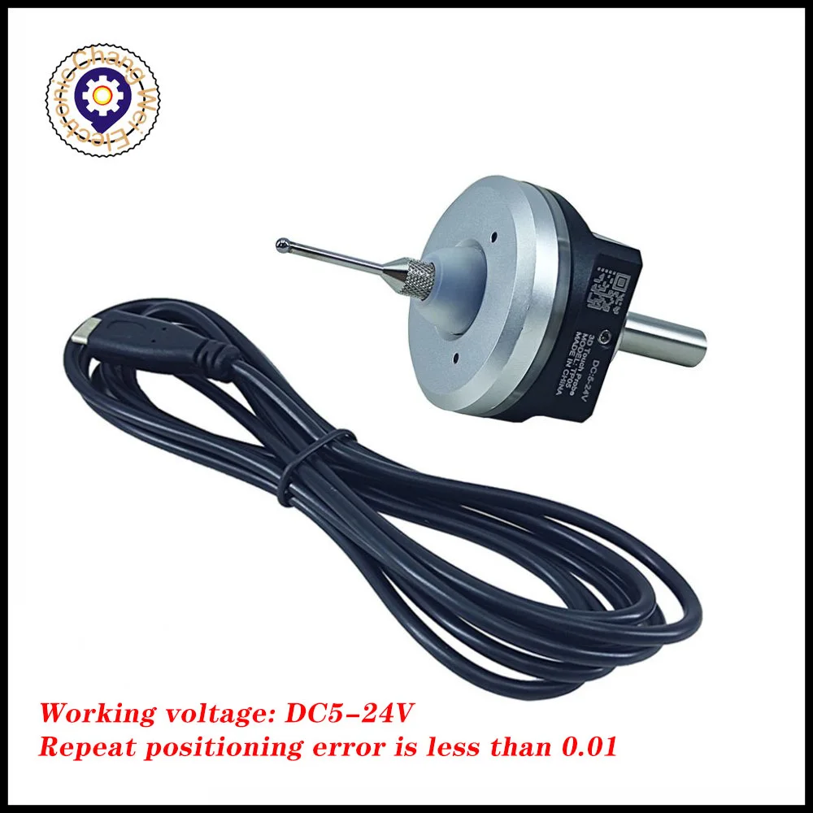
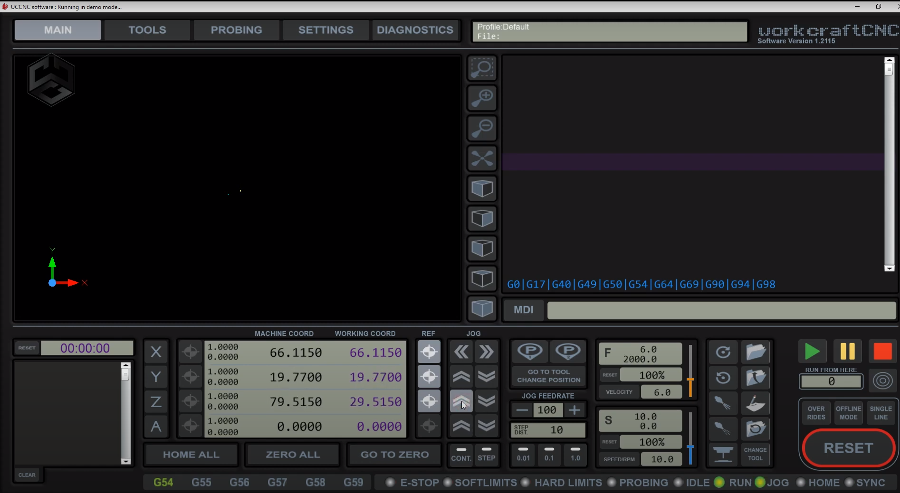
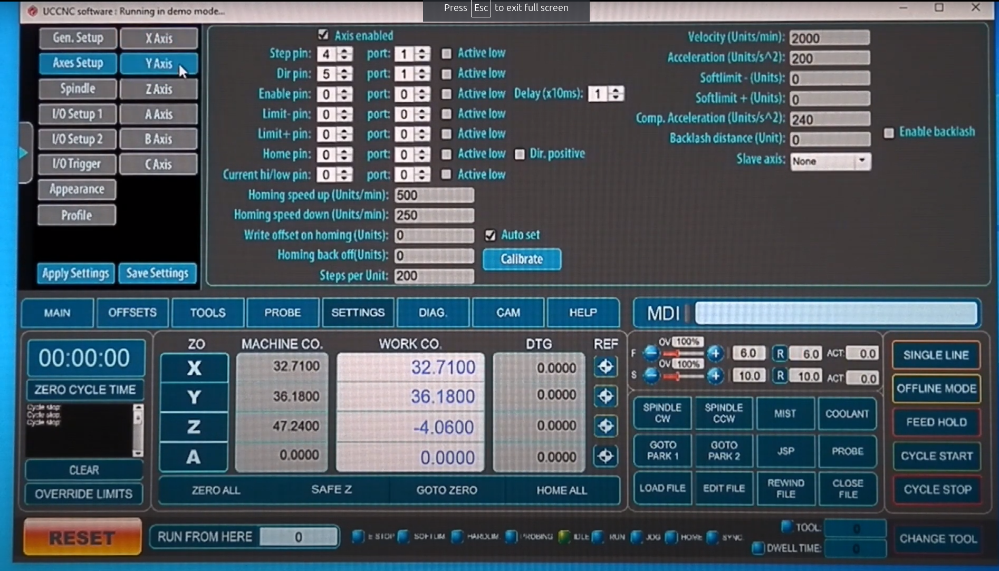

# Overview
This repository contains information about UCCNC from a begineer researching while installing a AXBB-E on a gantry router.

- [Overview](#overview)
- [CNC \& Components](#cnc--components)
  - [CNC](#cnc)
  - [Pendant](#pendant)
  - [Spindle + VFD](#spindle--vfd)
  - [Touch Probe](#touch-probe)
  - [VFD Settings](#vfd-settings)
  - [AXBB-E Schematics](#axbb-e-schematics)
- [UCCNC](#uccnc)
  - [Program](#program)
  - [Screensets](#screensets)
  - [Plugins](#plugins)
---

# CNC & Components
## CNC

[Bulkman Ultimate Bee Mechanical Kit](https://www.aliexpress.com/item/1005003778767537.html?spm=a2g0o.order_list.order_list_main.111.155f18022s9teN)
- 1000x1000mm
- 3N.m Closed-Loop stepper motors

## Pendant

[WHB04B-6](https://www.aliexpress.com/item/32866215829.html?spm=a2g0o.detail.0.0.730fJpTGJpTGLa&mp=1)

## Spindle + VFD

- G-penny 2.2kW, 220V, 400Hz, 2-pole, 80mm Spindle
- [HuanYang HY02D223B](https://www.aliexpress.com/item/1005004141428618.html?spm=a2g0o.detail.0.0.4753VxN3VxN3iC&mp=1) \
Manual here: [VFD Manual](manuals/HY01D523B-VFD-Manual.pdf)

## Touch Probe

## VFD Settings

- Really good info from Robert Olechowski [here](https://github.com/RobertOlechowski/Huanyang_VFD?tab=readme-ov-file).

My parameters see documentation [here](CNC/VFD%20parameters.txt).

## AXBB-E Schematics

CNC Drive Shop has pre-built cabinets and provide the schematics which helped me get started. \
https://www.shop.cncdrive.com/index.php?categoryID=113

Links to files: \
https://cncdrive.com/downloads/Sch_closedloop4axis.pdf \
https://cncdrive.com/downloads/Sch_closedloop5axis.pdf \
https://cncdrive.com/downloads/Controlbox_4AX__Scheme.pdf \
https://cncdrive.com/downloads/4ax_ACservo_schematics.pdf

### My Schematic & Layout

[Schematic](CNC/control_box/CNC%20Control%20Box-REV%201.pdf) \
[Layout](CNC/control_box/CNC%20Control%20Box%20Layout-REV%201.pdf)

# UCCNC

## Program
- Future Versions (currently 1.2116)
https://www.forum.cncdrive.com/viewtopic.php?f=2&t=240&start=50
- Main Forum:
https://www.forum.cncdrive.com/
- CNCZone Forum
https://www.cnczone.com/forums/uccnc-control-software/

## Screensets

- https://github.com/twentyfortysix/uccnc_screenset_2046

- http://www.thecncwoodworker.com/uccnc.html

|||
| --- | --- |

- https://neonscreenset.weebly.com/

- https://www.youtube.com/watch?v=5Km2x1G6RB4

- https://www.youtube.com/watch?v=-hrxSyROcWk

## Plugins
- [HuanYang VFD version 12](http://www.cnczone.com/forums/attachment.php?attachmentid=363852&d=1496484048)
- [WHB04B-6 Pendant Plugin](https://www.forum.cncdrive.com/viewtopic.php?f=14&t=2449)

The only one that works is the first one for me on the first page of the forum.  UCCNC 1.2113 and AXBB-E. \
Page 1:  WHB04B-4 Pendant \
Page 10: WHB04BPendant.rar

